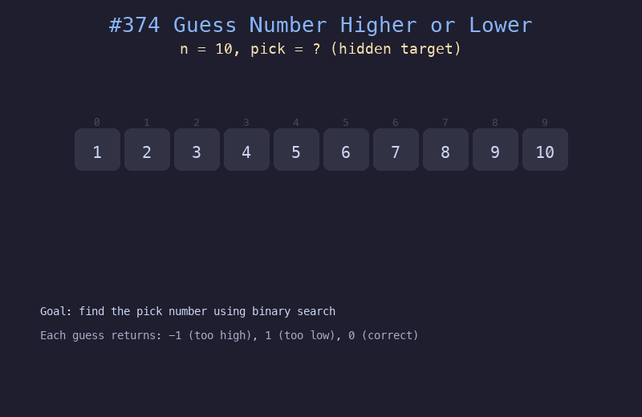

# 374. 猜数字大小

## 题目描述
猜数字游戏：从 1 到 n 中猜一个数字。每次猜测后会告诉你猜大了、猜小了还是猜对了。使用二分查找最小化猜测次数。

## 解题思路
1. 使用二分查找，初始范围为 [1, n]
2. 每次取中间值 mid，调用 guess(mid) 获取反馈
3. 如果猜大了则搜索左半部分，猜小了则搜索右半部分，猜对了直接返回

## 代码
```python
def guessNumber(n: int) -> int:
    lo, hi = 1, n
    while lo <= hi:
        mid = (lo + hi) // 2
        result = guess(mid)
        if result == 0:
            return mid
        elif result == -1:
            hi = mid - 1
        else:
            lo = mid + 1
    return -1
```

## 动画演示


## 复杂度分析
- **时间复杂度**: O(log n)
- **空间复杂度**: O(1)
