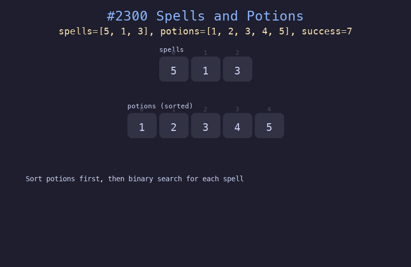

# 2300. 咒语和药水的成功对数

## 题目描述
给定两个数组 spells 和 potions，以及一个整数 success。对每个咒语，计算有多少个药水能与它组合成功（乘积 >= success）。

## 解题思路
1. 先将 potions 排序
2. 对每个 spell，计算需要的最小 potion 值：threshold = success / spell
3. 用二分查找找到第一个 >= threshold 的 potion 位置，后面所有药水都有效

## 代码
```python
def successfulPairs(spells, potions, success):
    potions.sort()
    n = len(potions)
    result = []
    for spell in spells:
        lo, hi, pos = 0, n - 1, n
        while lo <= hi:
            mid = (lo + hi) // 2
            if spell * potions[mid] >= success:
                pos = mid
                hi = mid - 1
            else:
                lo = mid + 1
        result.append(n - pos)
    return result
```

## 动画演示


## 复杂度分析
- **时间复杂度**: O(n log n + m log n)，n 为 potions 长度，m 为 spells 长度
- **空间复杂度**: O(n) 用于排序
