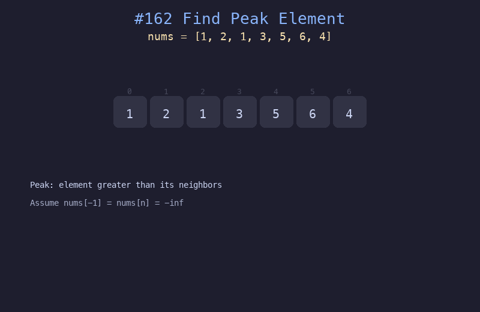

# 162. 寻找峰值

## 题目描述
峰值元素是指其值严格大于左右相邻值的元素。给定数组 nums，找到任一峰值元素并返回其索引。假设 nums[-1] = nums[n] = -inf。

## 解题思路
1. 使用二分查找，比较 nums[mid] 和 nums[mid+1]
2. 如果 nums[mid] < nums[mid+1]，说明右侧在上升，峰值在右侧
3. 否则左侧在上升或 mid 就是峰值，搜索左半部分（含 mid）

## 代码
```python
def findPeakElement(nums):
    lo, hi = 0, len(nums) - 1
    while lo < hi:
        mid = (lo + hi) // 2
        if nums[mid] < nums[mid + 1]:
            lo = mid + 1
        else:
            hi = mid
    return lo
```

## 动画演示


## 复杂度分析
- **时间复杂度**: O(log n)
- **空间复杂度**: O(1)
