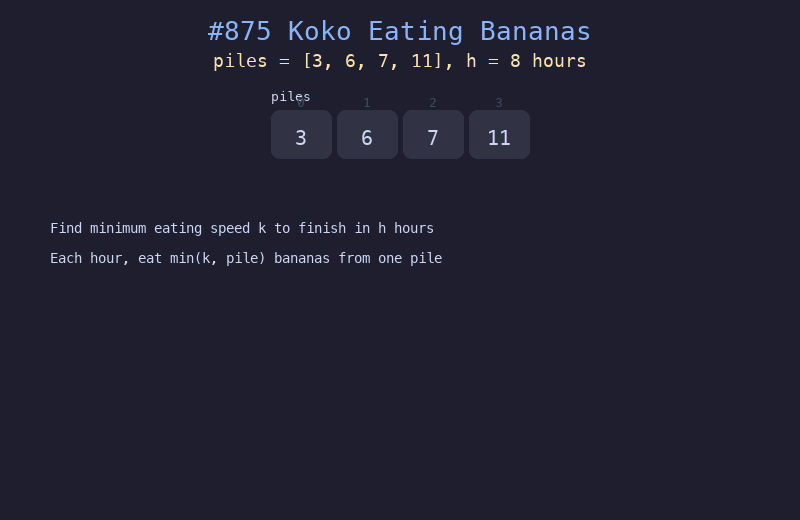

# 875. 爱吃香蕉的珂珂

## 题目描述
珂珂以速度 k 吃香蕉，每小时吃一堆中最多 k 根。如果该堆不足 k 根则全部吃完。在 h 小时内吃完所有香蕉的最小速度 k 是多少？

## 解题思路
1. 对速度 k 进行二分查找，范围 [1, max(piles)]
2. 对于每个 k，计算吃完所有堆所需总时间 = sum(ceil(pile/k))
3. 如果总时间 <= h，说明 k 可行，尝试更小的 k；否则增大 k

## 代码
```python
def minEatingSpeed(piles, h):
    lo, hi = 1, max(piles)
    while lo <= hi:
        mid = (lo + hi) // 2
        hours = sum(math.ceil(p / mid) for p in piles)
        if hours <= h:
            hi = mid - 1
        else:
            lo = mid + 1
    return lo
```

## 动画演示


## 复杂度分析
- **时间复杂度**: O(n * log(max(piles)))
- **空间复杂度**: O(1)
