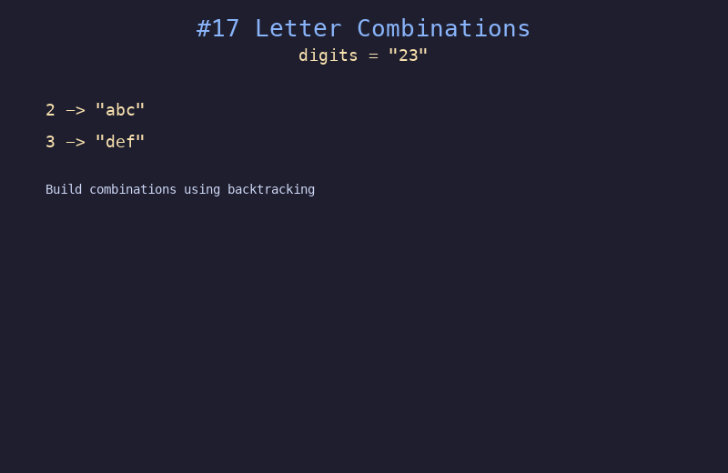

# 17. 电话号码的字母组合

## 题目描述
给定一个仅包含数字 2-9 的字符串，返回所有它能表示的字母组合。数字到字母的映射与电话按键相同。

## 解题思路
1. 建立数字到字母的映射表
2. 使用回溯法，从第一个数字开始，依次尝试该数字对应的每个字母
3. 当路径长度等于 digits 长度时，将组合加入结果集

## 代码
```python
def letterCombinations(digits):
    if not digits:
        return []
    phone = {'2': 'abc', '3': 'def', '4': 'ghi', '5': 'jkl',
             '6': 'mno', '7': 'pqrs', '8': 'tuv', '9': 'wxyz'}
    result = []
    def backtrack(idx, path):
        if idx == len(digits):
            result.append("".join(path))
            return
        for letter in phone[digits[idx]]:
            path.append(letter)
            backtrack(idx + 1, path)
            path.pop()
    backtrack(0, [])
    return result
```

## 动画演示


## 复杂度分析
- **时间复杂度**: O(4^n * n)，n 为 digits 长度
- **空间复杂度**: O(n) 递归栈深度
