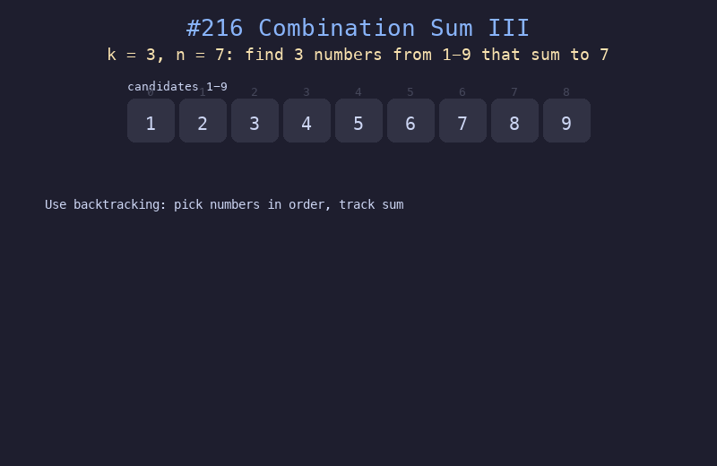

# 216. 组合总和 III

## 题目描述
找出所有相加之和为 n 的 k 个数的组合。组合中只允许使用数字 1 到 9，每个数字最多使用一次。

## 解题思路
1. 使用回溯法，从数字 1 开始依次尝试
2. 维护当前路径和累计和，当路径长度等于 k 时检查和是否为 n
3. 剪枝：当当前和已经 >= n 时提前终止

## 代码
```python
def combinationSum3(k, n):
    result = []
    def backtrack(start, path, cur_sum):
        if len(path) == k:
            if cur_sum == n:
                result.append(list(path))
            return
        if cur_sum >= n:
            return
        for i in range(start, 10):
            path.append(i)
            backtrack(i + 1, path, cur_sum + i)
            path.pop()
    backtrack(1, [], 0)
    return result
```

## 动画演示


## 复杂度分析
- **时间复杂度**: O(C(9, k))，从 9 个数中选 k 个的组合数
- **空间复杂度**: O(k) 递归栈深度
