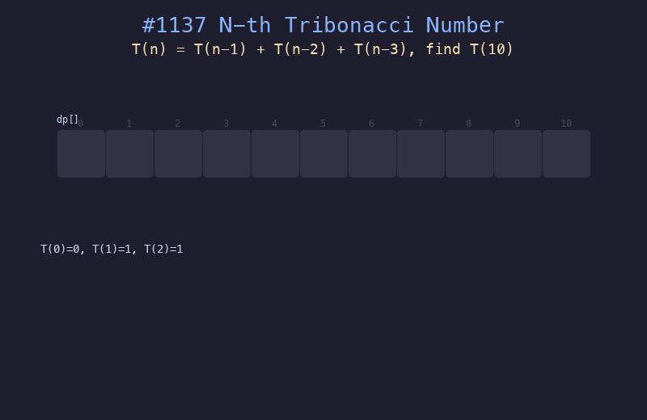

# 1137. 第 N 个泰波那契数

## 题目描述
泰波那契序列定义：T(0)=0, T(1)=1, T(2)=1, T(n)=T(n-1)+T(n-2)+T(n-3)。给定 n，返回 T(n)。

## 解题思路
1. 使用一维 DP 数组存储已计算的值
2. 基础情况：dp[0]=0, dp[1]=1, dp[2]=1
3. 递推：dp[i] = dp[i-1] + dp[i-2] + dp[i-3]

## 代码
```python
def tribonacci(n):
    if n == 0:
        return 0
    if n <= 2:
        return 1
    dp = [0] * (n + 1)
    dp[0], dp[1], dp[2] = 0, 1, 1
    for i in range(3, n + 1):
        dp[i] = dp[i-1] + dp[i-2] + dp[i-3]
    return dp[n]
```

## 动画演示


## 复杂度分析
- **时间复杂度**: O(n)
- **空间复杂度**: O(n)，可优化为 O(1) 只保留三个变量
