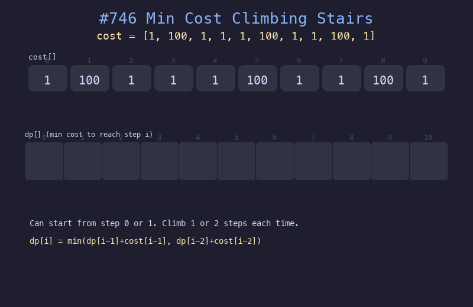

# 746. 使用最小花费爬楼梯

## 题目描述
给定整数数组 cost，其中 cost[i] 是从第 i 个台阶向上爬需要支付的费用。你可以从第 0 或第 1 个台阶开始，每次可以爬一个或两个台阶。请找到到达楼顶的最小花费。

## 解题思路
1. 定义 dp[i] 为到达第 i 个台阶的最小花费
2. 基础情况：dp[0]=0, dp[1]=0（可以免费从第 0 或第 1 阶开始）
3. 递推：dp[i] = min(dp[i-1]+cost[i-1], dp[i-2]+cost[i-2])

## 代码
```python
def minCostClimbingStairs(cost):
    n = len(cost)
    dp = [0] * (n + 1)
    for i in range(2, n + 1):
        dp[i] = min(dp[i-1] + cost[i-1], dp[i-2] + cost[i-2])
    return dp[n]
```

## 动画演示


## 复杂度分析
- **时间复杂度**: O(n)
- **空间复杂度**: O(n)，可优化为 O(1)
