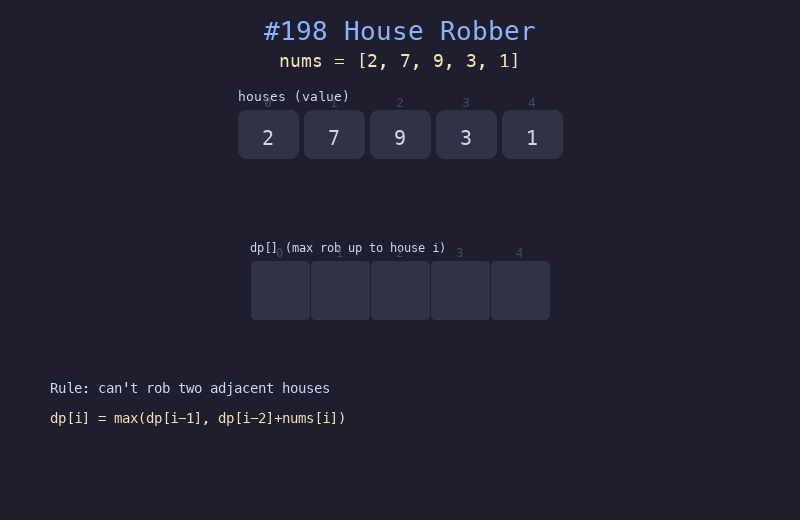

# 198. 打家劫舍

## 题目描述
一排房屋中存放着不同金额的财物。相邻的房屋不能同时被偷。求在不触动警报的情况下，能偷到的最高金额。

## 解题思路
1. 定义 dp[i] 为前 i 个房屋能偷到的最大金额
2. 基础情况：dp[0]=nums[0], dp[1]=max(nums[0],nums[1])
3. 递推：dp[i] = max(dp[i-1], dp[i-2]+nums[i])，即选择偷或不偷当前房屋

## 代码
```python
def rob(nums):
    if len(nums) == 1:
        return nums[0]
    dp = [0] * len(nums)
    dp[0] = nums[0]
    dp[1] = max(nums[0], nums[1])
    for i in range(2, len(nums)):
        dp[i] = max(dp[i-1], dp[i-2] + nums[i])
    return dp[-1]
```

## 动画演示


## 复杂度分析
- **时间复杂度**: O(n)
- **空间复杂度**: O(n)，可优化为 O(1)
