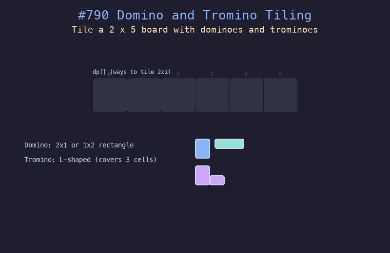

# 790. 多米诺和托米诺平铺

## 题目描述
有两种形状的瓷砖：一种 2x1 的多米诺形和一种 L 形的托米诺。给定整数 n，返回用这两种瓷砖铺满 2xn 面板的方案数。

## 解题思路
1. 定义 dp[i] 为铺满 2xi 面板的方案数
2. 基础情况：dp[0]=1, dp[1]=1, dp[2]=2
3. 递推：dp[i] = 2*dp[i-1] + dp[i-3]
4. 2*dp[i-1] 代表在 2x(i-1) 基础上放一块竖着的多米诺或两块横着的
5. dp[i-3] 代表用一对托米诺填充 3 列

## 代码
```python
def numTilings(n):
    MOD = 10**9 + 7
    if n <= 1:
        return 1
    if n == 2:
        return 2
    dp = [0] * (n + 1)
    dp[0], dp[1], dp[2] = 1, 1, 2
    for i in range(3, n + 1):
        dp[i] = (2 * dp[i-1] + dp[i-3]) % MOD
    return dp[n]
```

## 动画演示


## 复杂度分析
- **时间复杂度**: O(n)
- **空间复杂度**: O(n)
