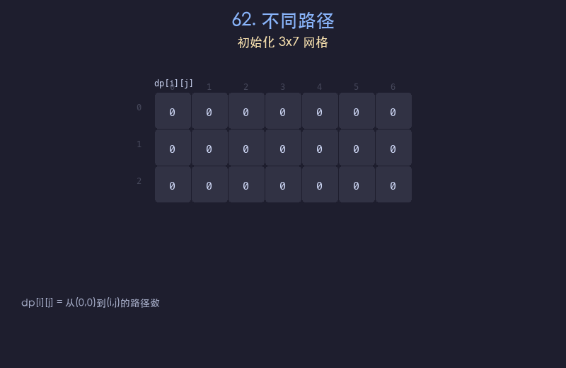

# 62. 不同路径

## 题目描述
一个机器人位于 m x n 网格的左上角，每次只能向下或者向右移动一步。求从左上角到右下角总共有多少条不同的路径。

## 解题思路
1. 定义 `dp[i][j]` 表示从 `(0,0)` 到 `(i,j)` 的不同路径数
2. 边界条件：第一行和第一列的所有格子只有一条路径（只能一直向右或一直向下）
3. 状态转移：`dp[i][j] = dp[i-1][j] + dp[i][j-1]`，即从上方或左方到达
4. 最终答案为 `dp[m-1][n-1]`

## 代码
```python
def uniquePaths(m, n):
    dp = [[1] * n for _ in range(m)]
    for i in range(1, m):
        for j in range(1, n):
            dp[i][j] = dp[i-1][j] + dp[i][j-1]
    return dp[m-1][n-1]
```

## 动画演示


## 复杂度分析
- **时间复杂度**: O(m * n)，遍历整个网格
- **空间复杂度**: O(m * n)，存储 DP 表格（可优化至 O(n)）
