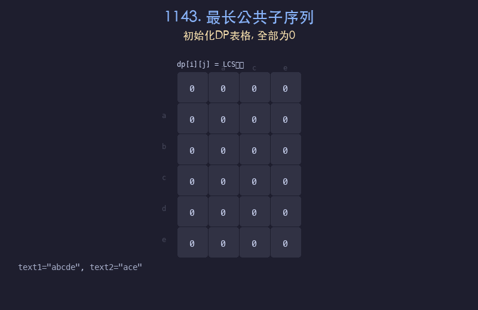

# 1143. 最长公共子序列

## 题目描述
给定两个字符串 `text1` 和 `text2`，返回这两个字符串的最长公共子序列的长度。子序列是指从原字符串中删除一些（或不删除）字符后，不改变剩余字符相对顺序得到的新字符串。

## 解题思路
1. 定义 `dp[i][j]` 表示 `text1` 前 `i` 个字符与 `text2` 前 `j` 个字符的 LCS 长度
2. 若 `text1[i-1] == text2[j-1]`，则 `dp[i][j] = dp[i-1][j-1] + 1`（匹配，继承左上角+1）
3. 否则 `dp[i][j] = max(dp[i-1][j], dp[i][j-1])`（取上方或左方的较大值）
4. 答案为 `dp[m][n]`

## 代码
```python
def longestCommonSubsequence(text1, text2):
    m, n = len(text1), len(text2)
    dp = [[0] * (n + 1) for _ in range(m + 1)]
    for i in range(1, m + 1):
        for j in range(1, n + 1):
            if text1[i-1] == text2[j-1]:
                dp[i][j] = dp[i-1][j-1] + 1
            else:
                dp[i][j] = max(dp[i-1][j], dp[i][j-1])
    return dp[m][n]
```

## 动画演示


## 复杂度分析
- **时间复杂度**: O(m * n)，遍历整个 DP 表格
- **空间复杂度**: O(m * n)，存储 DP 表格
