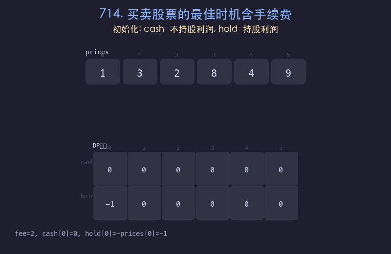

# 714. 买卖股票的最佳时机含手续费

## 题目描述
给定一个整数数组 `prices` 表示每天的股票价格，以及一个整数 `fee` 表示交易手续费。可以无限次买卖，但每笔交易需支付手续费。求最大利润。注意：同一时间最多持有一股。

## 解题思路
1. 定义两个状态：`cash[i]` 表示第 `i` 天不持股的最大利润，`hold[i]` 表示第 `i` 天持股的最大利润
2. 状态转移：
   - `cash[i] = max(cash[i-1], hold[i-1] + prices[i] - fee)`（保持不持股 或 卖出）
   - `hold[i] = max(hold[i-1], cash[i-1] - prices[i])`（保持持股 或 买入）
3. 初始化：`cash[0] = 0`, `hold[0] = -prices[0]`
4. 答案为 `cash[n-1]`

## 代码
```python
def maxProfit(prices, fee):
    n = len(prices)
    cash, hold = 0, -prices[0]
    for i in range(1, n):
        cash = max(cash, hold + prices[i] - fee)
        hold = max(hold, cash - prices[i])
    return cash
```

## 动画演示


## 复杂度分析
- **时间复杂度**: O(n)，遍历一次价格数组
- **空间复杂度**: O(1)，只使用两个变量（优化后）
