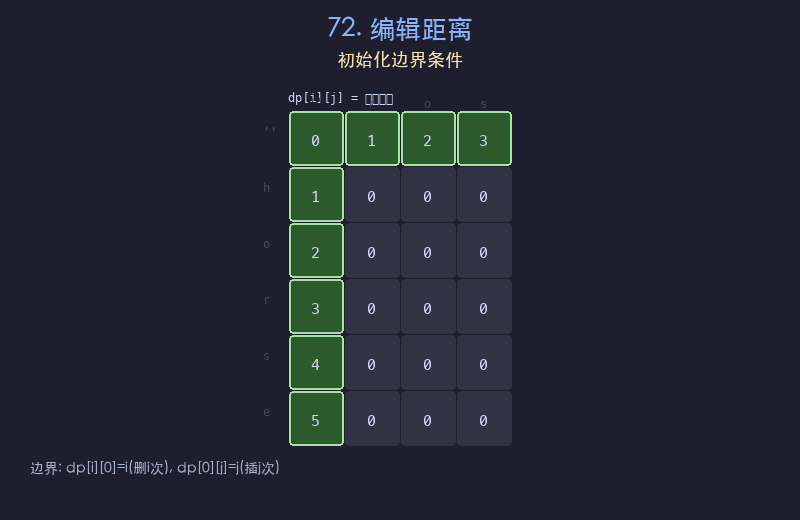

# 72. 编辑距离

## 题目描述
给你两个单词 `word1` 和 `word2`，请返回将 `word1` 转换成 `word2` 所使用的最少操作数。你可以对一个单词进行三种操作：插入一个字符、删除一个字符、替换一个字符。

## 解题思路
1. 定义 `dp[i][j]` 表示 `word1` 前 `i` 个字符转换为 `word2` 前 `j` 个字符所需的最少操作数
2. 边界条件：`dp[i][0] = i`（删 `i` 次），`dp[0][j] = j`（插 `j` 次）
3. 若 `word1[i-1] == word2[j-1]`，则 `dp[i][j] = dp[i-1][j-1]`（无需操作）
4. 否则 `dp[i][j] = 1 + min(dp[i-1][j], dp[i][j-1], dp[i-1][j-1])`，分别对应删除、插入、替换

## 代码
```python
def minDistance(word1, word2):
    m, n = len(word1), len(word2)
    dp = [[0] * (n + 1) for _ in range(m + 1)]
    for i in range(m + 1):
        dp[i][0] = i
    for j in range(n + 1):
        dp[0][j] = j
    for i in range(1, m + 1):
        for j in range(1, n + 1):
            if word1[i-1] == word2[j-1]:
                dp[i][j] = dp[i-1][j-1]
            else:
                dp[i][j] = 1 + min(dp[i-1][j], dp[i][j-1], dp[i-1][j-1])
    return dp[m][n]
```

## 动画演示


## 复杂度分析
- **时间复杂度**: O(m * n)，遍历整个 DP 表格
- **空间复杂度**: O(m * n)，存储 DP 表格
