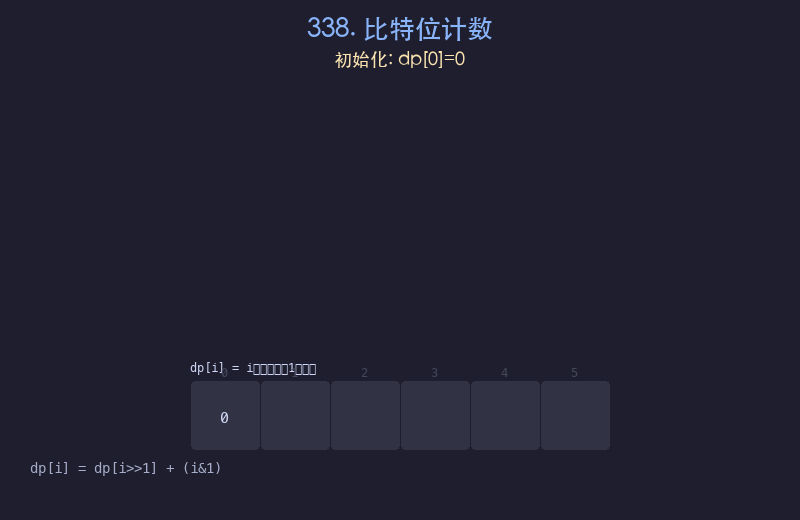

# 338. 比特位计数

## 题目描述
给你一个整数 `n`，对于 `0 <= i <= n` 中的每个 `i`，计算其二进制表示中 `1` 的个数，返回一个长度为 `n+1` 的数组 `ans`。

## 解题思路
1. 利用位运算的 DP 关系：`dp[i] = dp[i >> 1] + (i & 1)`
2. `i >> 1` 是 `i` 右移一位（去掉最低位），其 1 的个数已经在之前计算过
3. `i & 1` 判断最低位是否为 1，若是则多加 1
4. 从 0 开始递推即可

## 代码
```python
def countBits(n):
    dp = [0] * (n + 1)
    for i in range(1, n + 1):
        dp[i] = dp[i >> 1] + (i & 1)
    return dp
```

## 动画演示


## 复杂度分析
- **时间复杂度**: O(n)，遍历 0 到 n
- **空间复杂度**: O(n)，存储结果数组
