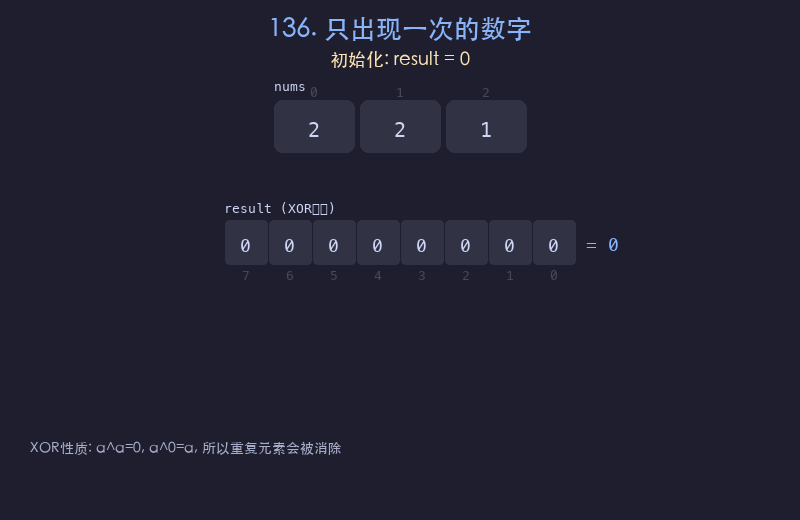

# 136. 只出现一次的数字

## 题目描述
给你一个非空整数数组 `nums`，除了某个元素只出现一次以外，其余每个元素均出现两次。找出那个只出现了一次的元素。要求线性时间复杂度且不使用额外空间。

## 解题思路
1. 利用异或运算的性质：`a ^ a = 0`（相同数字异或为 0），`a ^ 0 = a`（与 0 异或保持不变）
2. 将数组中所有元素依次异或，成对出现的元素会互相消除
3. 最终结果就是只出现一次的那个元素

## 代码
```python
def singleNumber(nums):
    result = 0
    for num in nums:
        result ^= num
    return result
```

## 动画演示


## 复杂度分析
- **时间复杂度**: O(n)，遍历一次数组
- **空间复杂度**: O(1)，只使用一个变量
