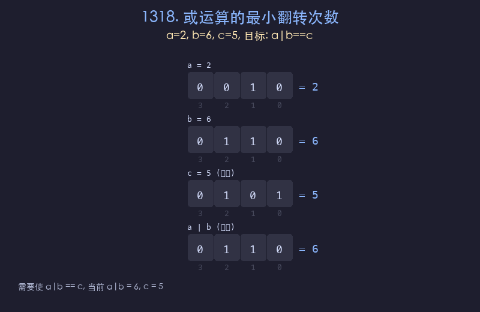

# 1318. 或运算的最小翻转次数

## 题目描述
给你三个正整数 `a`、`b` 和 `c`，返回翻转 `a` 和 `b` 的二进制位的最小次数，使得 `a OR b == c`。翻转一次表示将某个二进制位从 0 变为 1 或从 1 变为 0。

## 解题思路
1. 逐位比较 `a`、`b`、`c` 的对应二进制位
2. 若 `c` 的当前位为 1：只需 `a` 或 `b` 中至少有一个为 1，若都为 0 则翻转 1 次
3. 若 `c` 的当前位为 0：`a` 和 `b` 的当前位都必须为 0，每个为 1 的位都需翻转
4. 累加所有位上的翻转次数

## 代码
```python
def minFlips(a, b, c):
    flips = 0
    while a or b or c:
        bit_a, bit_b, bit_c = a & 1, b & 1, c & 1
        if bit_c == 1:
            if bit_a == 0 and bit_b == 0:
                flips += 1
        else:
            flips += bit_a + bit_b
        a >>= 1
        b >>= 1
        c >>= 1
    return flips
```

## 动画演示


## 复杂度分析
- **时间复杂度**: O(log(max(a, b, c)))，逐位检查
- **空间复杂度**: O(1)，只使用常数变量
