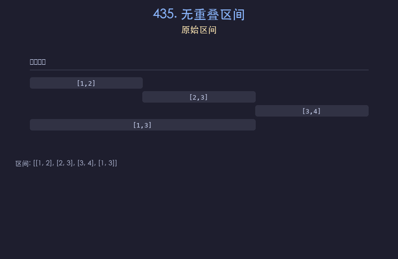

# 435. 无重叠区间

## 题目描述
给定一个区间的集合 `intervals`，返回需要移除区间的最小数量，使得剩余区间互不重叠。

## 解题思路
1. 按区间的结束时间升序排序
2. 贪心策略：优先保留结束时间早的区间，为后续区间留出更多空间
3. 遍历排序后的区间，若当前区间的起始时间 >= 上一个保留区间的结束时间，则保留
4. 否则该区间与前一个重叠，需要移除

## 代码
```python
def eraseOverlapIntervals(intervals):
    intervals.sort(key=lambda x: x[1])
    count = 0
    end = float('-inf')
    for s, e in intervals:
        if s >= end:
            end = e
        else:
            count += 1
    return count
```

## 动画演示


## 复杂度分析
- **时间复杂度**: O(n log n)，排序占主导
- **空间复杂度**: O(1)，只使用常数变量（不计排序空间）
