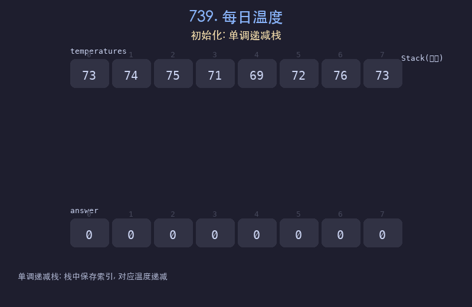

# 739. 每日温度

## 题目描述
给定一个整数数组 `temperatures` 表示每天的温度，返回一个数组 `answer`，其中 `answer[i]` 表示从第 `i` 天起，需要等几天才能等到一个更高温度。如果之后没有更高温度，则 `answer[i] = 0`。

## 解题思路
1. 使用单调递减栈，栈中存储索引（对应温度从栈底到栈顶递减）
2. 遍历温度数组，若当前温度 > 栈顶索引对应的温度，则弹出栈顶并计算等待天数
3. `answer[栈顶索引] = 当前索引 - 栈顶索引`
4. 将当前索引压入栈，保持单调性

## 代码
```python
def dailyTemperatures(temperatures):
    n = len(temperatures)
    answer = [0] * n
    stack = []
    for i in range(n):
        while stack and temperatures[i] > temperatures[stack[-1]]:
            idx = stack.pop()
            answer[idx] = i - idx
        stack.append(i)
    return answer
```

## 动画演示


## 复杂度分析
- **时间复杂度**: O(n)，每个元素最多入栈和出栈各一次
- **空间复杂度**: O(n)，栈的最大大小
