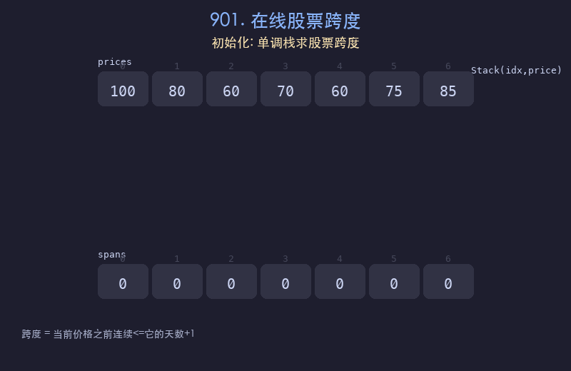

# 901. 在线股票跨度

## 题目描述
设计一个类 `StockSpanner`，收集某些股票的每日报价，并返回该股票当日价格的跨度。跨度定义为从今天开始往回数，股票价格连续小于或等于今天价格的最大天数（包括今天）。

## 解题思路
1. 使用单调递减栈，栈中存储 `(索引, 价格)` 对
2. 每次新价格到来时，弹出栈中所有价格 <= 当前价格的元素
3. 跨度 = 当前索引 - 栈顶索引（若栈空则为 当前索引 + 1）
4. 将当前价格压入栈

## 代码
```python
class StockSpanner:
    def __init__(self):
        self.stack = []
        self.idx = 0

    def next(self, price):
        while self.stack and price >= self.stack[-1][1]:
            self.stack.pop()
        if self.stack:
            span = self.idx - self.stack[-1][0]
        else:
            span = self.idx + 1
        self.stack.append((self.idx, price))
        self.idx += 1
        return span
```

## 动画演示


## 复杂度分析
- **时间复杂度**: 均摊 O(1)，每个元素最多入栈出栈各一次
- **空间复杂度**: O(n)，栈的最大大小
